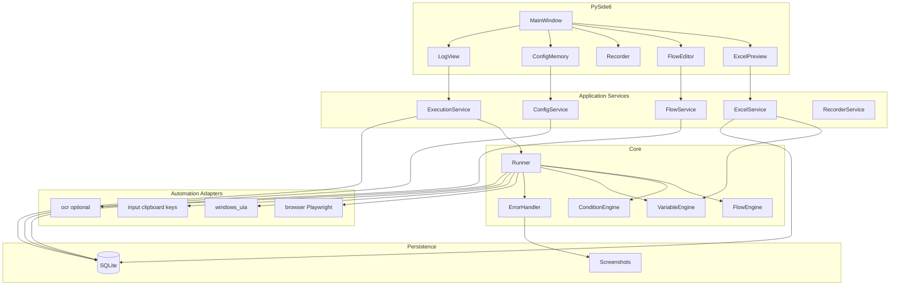

# Anything_Auto — 技术架构

本文档与 `docs/DEVELOPMENT_PLAN.md` 配套，定义分层结构、领域模型、自动化适配器契约、SQLite 概览及主要风险。实现时以 `project.md` 业务约束为准。

## 1. 逻辑架构



**Runner 对单步的默认策略**：若 `target` 同时携带多类定位信息，按 `project.md` 约定顺序尝试 — **DOM → UIA → OCR → 坐标/键盘兜底**，并把实际使用的 `strategy_used` 写入 `step_runs`。

---

## 2. 核心领域模型（概略）

实现语言可用 `dataclass` + Pydantic v2 或纯 dataclass + 自建校验。

| 模型 | 职责要点 |
|------|----------|
| **Flow** | id、name、version、status、steps 列表、变量 schema、时间戳 |
| **Step** | type（click/input/wait/hotkey/activate_window/open_url/if/...）、target、value、condition、then/else 子步骤、timeout、retry、on_error、`order_index` |
| **Execution** | 关联 flow_id、config_id、`batch_id`、来源行列、`variables` 快照、状态机、当前 step、错误与截图路径、起止时间 |
| **Config** |「记忆」：Excel 路径、Sheet、mapping_id、flow_id、目标窗口标题、CDP URL、默认超时/重试、截图与日志目录等 |
| **ExcelMapping** | 选中列、表头行、`variable_map`（列名→变量名）、校验/清洗规则 |

详细字段与表结构见下节 SQLite；Step 的 `type` 枚举在实现阶段收敛为一处常量，避免 UI/Runner/存储不一致。

---

## 3. 自动化适配器接口

所有适配器返回统一 **`ActionResult`**：`ok`、`value`、`strategy_used`、`error`、`screenshot_path`、`metadata`。

### 3.1 `BrowserAutomationAdapter`（Playwright）

- `connect(cdp_url?)`、`open_url`、`click`、`input_text`、`read_text`、`read_table`、`wait_for`、`exists`、`screenshot`

### 3.2 `WindowsUiaAutomationAdapter`

- `find_window` / `activate_window`、`click_control`、`input_text`、`read_text`、`exists`

### 3.3 `InputAutomationAdapter`

- 坐标点击、键盘输入、热键、剪贴板、打开程序/文件（与 `pyautogui`/pynput/pyperclip 等组合）

### 3.4 `OcrAutomationAdapter`（后置）

- 区域截图、识别、按文字点击；仅在 DOM/UIA 不可用时启用

**定位负载 `TargetSpec`（概念）**：可包含 `dom`、`uia`、`ocr`、`coordinate` 等子结构；Runner 按优先级尝试。

---

## 4. SQLite 表概览

大对象（截图、完整导出）仅存路径；定义 JSON 可存 `flows.definition_json` 或规范化 `steps` 表，二选一但忌重复真相来源。

| 表 | 用途 |
|----|------|
| `flows` | 流程元数据 + `definition_json`（若不分步存） |
| `steps` | 若规范化逐步存储；含 `parent_step_id` 支持树形 IF |
| `configs` | 用户配置与记忆 |
| `excel_mappings` | 列映射与校验规则 |
| `excel_rows` | 某次导入或批次的行级缓存与校验结果（可选） |
| `executions` | 每次行执行/单次运行 |
| `step_runs` | 每步输出与策略 |
| `artifacts` | 截图、导出文件等元数据 |

启用 **WAL**；Runner 与 UI 写入通过短事务 + 队列，避免长时间锁表。

---

## 5. 线程与并发

- **Qt 主线程**：仅 UI。
- **Runner**：`QThread` 或 `concurrent.futures` + 与主线程的队列/信号通信。
- 禁止在 Runner 内直接操作 Qt 控件。

---

## 6. 主要技术风险与缓解

| 风险 | 缓解 |
|------|------|
| 纯坐标脆弱 | 分层目标 + 执行前统一激活窗口与最大化策略（可配置） |
| iframe/canvas 导致 DOM 读不到 | Playwright frame 遍历；必要时 OCR 分支并记录低置信度 |
| 跨应用输错窗 | 每步键盘/剪贴板前校验前台窗口标题/进程名 |
| Excel 脏数据 | 预览期强校验；执行前可选阻断 |
| 条件表达式安全 | 白名单 DSL，禁止任意代码求值 |
| SQLite 锁 | WAL、短事务、Runner 异步 |

---

## 7. 推荐仓库布局

与 `project.md` 第十九节对齐，并增加 `services/` 与 `tests/`：

```text
rpa_assistant/
├── main.py
├── pyproject.toml
├── requirements.txt
├── README.md
├── app/
│   ├── ui/
│   ├── services/
│   ├── core/
│   ├── automation/
│   ├── excel/
│   ├── storage/
│   └── models/
├── data/           # 默认 SQLite
├── logs/
├── screenshots/
├── flows/
├── configs/
└── tests/
```

---

## 文档版本

- **v0.1**：2026-05-14，与开发计划同步初版。
