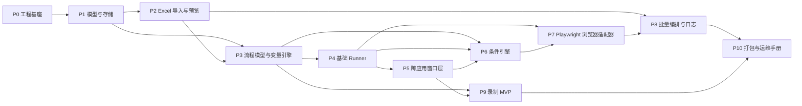

# Anything_Auto — 开发计划（多代理分析合成）

本文档由需求基线 `project.md`（Windows 跨应用 RPA、Excel 批量、PySide6、SQLite、混合定位策略）与规划/架构子代理分析合并而成，用于多会话、多 PR 的冷启动执行。

## 1. 项目定位与边界

**定位**：面向 Windows 的跨应用轻量 RPA — 从 Excel 读取批量数据 → 变量化 → 在多应用（浏览器、Office、资源管理器等）间执行可配置流程 → 条件分支、预览与配置记忆、日志与失败处理。

**非目标（MVP 不做）**：复杂拖拽式流程设计器、多用户权限、云端调度、全自动 AI 修流程、大规模并发、完整 OCR/图像模板体系（除非为打通某页而定点引入）。

**执行策略优先级**（与 `project.md` 一致）：Playwright DOM / Windows UIA → OCR / 图像 → 坐标兜底。

---

## 2. 假设与约束

| 类别 | 内容 |
|------|------|
| 运行环境 | Windows 桌面为主；开发与验收以可控 Windows 机为准 |
| 技术栈 | Python 3.11+、PySide6、SQLite、Playwright、Excel 读取（openpyxl/pandas 等）、pywinauto/UIA、pynput/pyautogui、剪贴板 |
| 安全 | MVP 可接受手工登录业务系统；不在本地明文存密码；条件表达式禁止裸 `eval` |
| 数据 | Excel 行为一等公民；每行映射为运行时变量 |

---

## 3. MVP 成功标准（可验收）

1. 可选 `.xlsx`、选 Sheet、列映射（至少 3 列）、预览 ≥100 行无崩溃。
2. 选中行逐行执行；每行变量注入 `${字段名}` 生效。
3. 持久化：Excel 路径、Sheet、列映射、所选流程、目标窗口/浏览器标题、超时/重试、截图与日志开关等（记忆界面）。
4. 流程能力至少包含：`activate_window`、`open_url`、`open_file`、点击/输入、等待、热键、剪贴板、`if`、变量替换。
5. 批量状态：pending / running / success / failed / skipped；失败记录原因、时间、行号、变量快照、截图路径。
6. **最小业务闭环**：Excel → 预览 → 选流程 → 逐行执行 → 激活浏览器 → 输入当前行关键字段 → 读取页面合同类型（或等价文本）→ IF 分支 → 点击/输入 → 记结果 → 下一行（与 `project.md`「二十二」一致）。
7. 手工验收：约 20 行 Windows 批量跑批，含 1 次强制失败、跳行/重试场景，结果与导出可追溯、无数据丢失。

---

## 4. 阶段依赖（P0→P10）

| 阶段 | 目标 | 阻塞下游 |
|------|------|----------|
| P0 | 可运行 PySide6 壳、目录、日志、配置路径 | 全部 |
| P1 | SQLite、配置/流程/执行持久化契约 | P2–P10 |
| P2 | Excel 读取、列映射、预览与校验 | 批量执行 |
| P3 | Flow/Step JSON 模型、变量替换 | Runner、条件、录制 |
| P4 | Runner 顺序执行、步骤日志 | 自动化与批量 |
| P5 | 窗口查找/激活、剪贴板、打开文件/URL | 跨应用闭环 |
| P6 | IF/ELSE、安全条件 DSL | 分支业务 |
| P7 | Playwright 连接/选读文本/表格/点击 | 浏览器主导场景 |
| P8 | 按行编排、暂停继续、导出、截图 | MVP 交付 |
| P9 | 录制→可编辑步骤→保存流程（可晚于首版闭环） | 效率提升 |
| P10 | PyInstaller、安装说明、验收清单 | 外发运维 |

---

## 5. 并行工作流（在 Schema 稳定后）

- **P1 完成后**：Excel 预览 UI 与仓库层 CRUD 可并行。
- **P3 完成后**：Runner 动作实现、条件引擎初版、简易流程编辑表格可并行（需统一 Step schema）。
- **P4 完成后**：Windows 窗口层与 Playwright 适配器可并行。
- **P8 完成后**：录制 MVP、导出报表 polish、打包可并行。

**关卡**：`Step` / 序列化格式在 P3 末冻结一版，避免 Runner、UI、录制、存储四方反复返工。

---

## 6. PR 级步骤（12 步）

每步含**冷启动摘要**：任意新会话代理只需读本步 + `docs/ARCHITECTURE.md` 即可开工。

### Step 1 — 应用基座（风险：低）

- **目标**：`python -m` 或 `main.py` 启动 PySide6 主窗；建立 `app/` 包、`requirements.txt`/`pyproject.toml`。
- **产出**：空菜单/占位页、日志目录、用户数据目录约定。
- **验收**：启动无报错；SQLite 文件路径可配置。
- **上下文摘要**：仓库名 `rpa_assistant`（与架构文档一致）；先不做业务逻辑。

### Step 2 — SQLite 与仓储（风险：中）

- **目标**：`database.py`、WAL、迁移钩子；`config_repo` / `flow_repo` / `execution_repo`（初版最小表集见 `ARCHITECTURE.md`）。
- **验收**：单元测试写入/读取 config、flow definition、一次 execution 与 step_run。

### Step 3 — Excel 导入与校验（风险：中）

- **目标**：`excel/reader.py`、`validator.py`、`mapper.py`；支持选文件、Sheet、表头行、列勾选、空值/重复提示。
- **验收**：fixtures 下 `.xlsx` 预览与校验结果与预期一致。

### Step 4 — 预览与记忆 UI（风险：低）

- **目标**：表格预览页；保存/恢复上次路径、Sheet、映射、所选流程 id、窗口标题等。
- **验收**：重启应用后配置恢复；映射与预览一致。

### Step 5 — 流程模型与变量引擎（风险：中）

- **目标**：`Flow`/`Step` 的 Pydantic/dataclass + JSON 序列化；`${var}` 替换；步骤表或 JSON 存储二选一（与架构一致）。
- **验收**：给定 JSON + 一行变量，渲染后步骤参数无未解析占位符（或明确报错）。

### Step 6 — 基础 Runner（风险：中）

- **目标**：`runner.py` 顺序执行 wait/hotkey/clipboard/坐标点击等；**工作线程**执行，Qt 信号回传进度。
- **验收**：Mock 适配器下全流程日志顺序正确；主线程不阻塞。

### Step 7 — Windows 跨应用控制（风险：高）

- **目标**：按标题查找/激活窗口；`open_file` / 启动程序；输入前校验前台窗口。
- **验收**：手工脚本级测试：记事本/计算器/资源管理器切换与输入。

### Step 8 — 条件引擎（风险：中）

- **目标**：安全 DSL（等于、包含、文件存在、窗口存在、上一步结果）；`if`/`then`/`else` 嵌套与 `FlowEngine` 整合。
- **验收**：单元测试覆盖主要运算符；无 `eval`。

### Step 9 — Playwright 适配器（风险：高）

- **目标**：连接已启动浏览器（CDP）或 launch；`get_by_text`、表格读取、基本 iframe；与 Runner 统一 `ActionResult`。
- **验收**：对内置或固定测试 HTML 页完成读字、点击、分支。

### Step 10 — 批量编排与日志导出（风险：高）

- **目标**：按勾选行循环、行级状态、失败截图路径、暂停/继续/取消、结果导出（Excel/CSV）。
- **验收**：20 行场景与成功标准第 7 条一致。

### Step 11 — 录制 MVP（风险：高）

- **目标**：录制鼠标/键盘/窗口切换事件 → 生成可编辑步骤列表 → 存为 Flow。
- **验收**：简单跨应用序列可录制回放（允许坐标兜底）。

### Step 12 — 打包与验收清单（风险：中）

- **目标**：PyInstaller spec、README 安装步骤、`docs/ACCEPTANCE_CHECKLIST.md`（可选另文）。
- **验收**：干净 Windows 环境可按文档跑通最小闭环。

---

## 7. 测试策略

| 层级 | 范围 |
|------|------|
| 单元 | 变量替换、条件 DSL、Excel 校验、仓储 CRUD、Flow 序列化 |
| 集成 | Mock 适配器 + Runner 全长；批量状态机 |
| 手工 E2E | 真实 Windows + 登录后浏览器 + 业务页（或仿真页） |
| 浏览器回归 | 固定 HTML fixture 页（表格、多按钮、iframe） |

---

## 8. 延期需求清单（自 `project.md`）

拖拽式可视化设计器、多租户/权限、云调度、全智能 OCR 表格、大规模并发、高级语义录制、验证码处理等 — 列入 `docs/BACKLOG.md` 可选，或由后续迭代单独立项。

---

## 9. 计划变更协议（精简版）

- **拆步**：单 PR 超过 400 行核心逻辑或验收失败 → 拆成子步并更新本文档版本号。
- **跳过**：仅当依赖项未就绪且不影响已发布里程碑说明；需在 PR 中注明原因。
- **并行**：新增并行流必须写明与共享文件列表，避免冲突。

---

## 文档版本

- **v0.1**：2026-05-14，初版（Planner + Code Architect 合成）。
